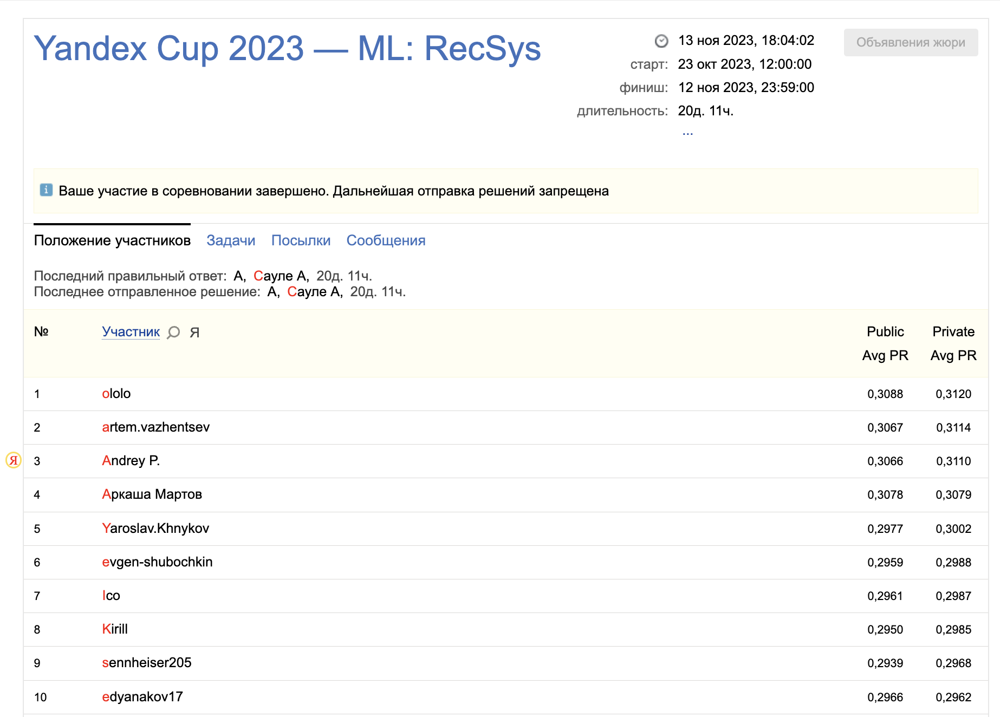
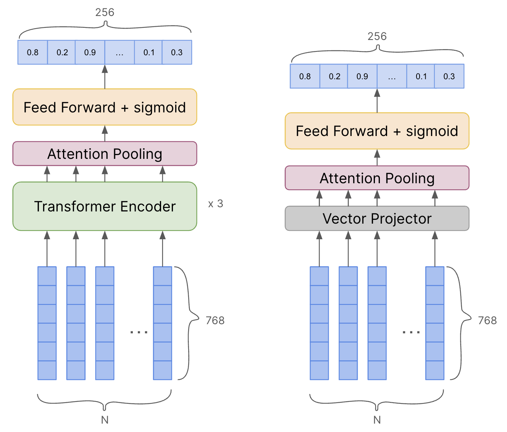

# Yandex Cup 2023 - ML: RecSys
> Python 3.10.12


**Ledearboard**: *3rd place* \
**Public score**: *0.3066*	\
**Private score**: *0.3110*

[Task description](https://contest.yandex.com/contest/54251/problems/ ): \
Predict a music tags probabilities. Tags quantity is `256`.
Each track is described by embeddings of dimension (N, 768), where N depends on the track length.
The main testing metric is [Average Precision](https://scikit-learn.org/stable/modules/generated/sklearn.metrics.average_precision_score.html).



# Download data 
```
cd data
bash download_data.sh
```
Output: 
```text
data/
    download_data.sh
    track_embeddings.tar.gz
    data.tar.gz
    track_embeddings/
        0.npy
        ...
        76713.npy
    train.csv
    test.csv
```

# Prepare dataset for training
Run [utils/prepare_dataset.py](utils/prepare_dataset.py)
It will create 3 files in data directory: 
- `metadata.csv`           - dataset with `stage` column (train/val)
- `bce_class_weights.pth`  - tags weight for WeightedBCELoss
- `class_freq.pkl`         - tags frequency for ResampleLoss
```bash
python utils/prepare_dataset.py
```

# Run single experiment
1. Configure `Config` class in [main.py](./main.py)
2. Use your own `optimizer`, `criterion`, `scheduler` if needed. You can change it in main function
3. Run training
```bash
python main.py
```

> All artifacts (logs, weights, files) will be saved in `Config.logs_dir`

# Run ensemble experiment
1. Configure `Config` class in [folds_main.py](./folds_main.py)
2. Use your own `optimizer`, `criterion`, `scheduler` if needed. You can change it in main function
3. Run training
```bash
python folds_main.py
```
> All artifacts (logs, weights, files) will be saved in `Config.logs_dir`

# Create final submission (Ensemble of ensembles? `:)`)
- Prepare experiments with model weights in `_EXPERIMENTS` directory
- Run [notebooks/final_submission.ipynb](notebooks/final_submission.ipynb)

# Tensorboard training/validation results analysis
```bash
tensorboard --logdir _EXPERIMENTS/
```

# My final submission 

### Модели
Итоговое решение состоит из 7 трансформеров и 1 MLP с различными параметрами обучения:
Лучшие модели (ансамбль дает 0.3+):
- [public=0.2996] Transformer (layers=3, heads=8, max_crop=120) + Attention Pooling + FF
- [public=0.2988] Transformer (layers=3, heads=4, max_crop=240) + AP + FF
- [public=0.2952] Transformer w/ RMSNorm (layers=3, heads=8, max_crop=50, fixed_crop) + AP + FF

Добавочные модели, чтобы докинуть крохи в тысячных знаках
- [public=0.2993] Transformer (layers=4, heads=4, max_crop=120) + AP + FF
- [public=0.2948] Transformer + AP + FF
- [public=0.2946] Transformer w/ RMSNorm + AP + FF
- [public=0.2832] Transformer + AP + FF (weighted_bce_loss)
- [public=0.24] Vector projector + AP + FF (MLP из baseline с измененным pooling)

[папка с весами моделей](https://disk.yandex.ru/d/qWprntnoDrZbPA) 



### Данные
- mixup (сложение эмбеддингов двух треков с разными весами)
- cutmix (земена случайных эмбеддингов одного трека на эмбеддинги из другого трека)
- разворот эмбеддингов трека в другом порядке
- маскирование части эмбеддингов трека
- сдвиг эмбеддигов трека на на случайно значение (`torch.roll`)
- сортировка треков по убыванию длины внутри батча 
- использование max_crop=50 и 120 для двух моделей в ансамбле (то есть на обучении если трек превышал max_crop, то брался его случайный кусок)
- label smoothing

### Обучение
- automatic mixed precision 
- gradient clipping

**Loss** 
- WeightedBCELoss (веса брал просто `1 / <частота тега в train>`)
- ResampleLoss - [github авторов](https://github.com/wutong16/DistributionBalancedLoss)

**Optimizer**
- Lion (lr=3e-5, weight_decay=0.01) - [github авторов](https://github.com/google/automl/blob/master/lion/lion_pytorch.py)

**Scheduler**
- CosineAnnealingLR (eta_min=1e-8, T_max=num_epochs)

**Ансамблирование**
- Почти все модели обучались на фолдах. Потом лучшие на public блендились в один сабмит

### Hardware
- Intel(R) Core(TM) i5-6600K CPU @ 3.50GHz
- RTX 2060s 8GB

### Что не зашло
- Curriculum learning (увеличение max_len по ходу обучения) заходил, пока не появилось больше аугментаций
- Contrastive pretraining и в целом contrastive подобные лоссы
- 256 классификаторов на каждый класс
- обучение разных моделей на частотных и малочастотных тегах
- нормировка входных фичей
- перенормировка весов обученных моделей в соответствии с long-tail распределением
- Catboost на выходах нейронных сетей из ансамбля
- LightAutoML (даже не дождался пока посчитается хоть что-то)
- Бустинг из нейронок (не успел завести, да и ресурсов бы не хватило на такое)